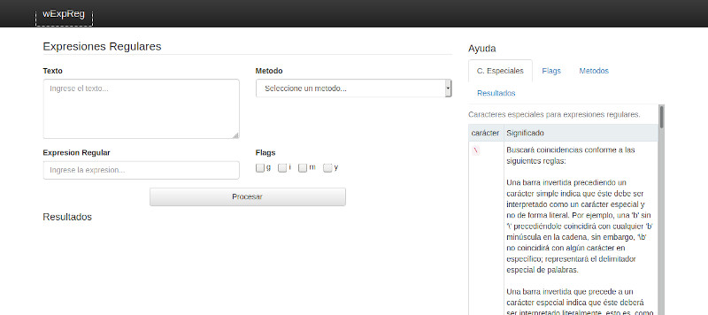

# wExpReg
Aplicacion web para probar expresiones regulares.

## Comenzando 🚀

### Pre-requisitos 📋

Servidor web con alguna de las siguientes opciones:
* Apache server
* PHP 7: php -S 127.0.0.1:8080
* Python 2: python -m SimpleHTTPServer 8080
* Python 3: python -m http.server 8080

### Instalación 🔧

Puedes clonar este repositorio o descargar el codigo fuente.
Luego copias el directorio con sus archivos dentro del directorio raiz de tu servidor.

## Construido con 🛠️

* [Bootstrap 3](https://getbootstrap.com/docs/3.3/) - Framework CSS-JS usado.
* [JQuery 1.4](https://jquery.com/) - Libreria JS usada.

## Autores ✒️

**AB software** - *Idea y desarrollo* - [zeus76ar](https://github.com/zeus76ar) - absoft.dev@gmail.com

## Licencia 📄

Este proyecto está bajo la Licencia (GNU GPL v3.0) - mira el archivo [LICENSE](LICENSE) para mas detalles
